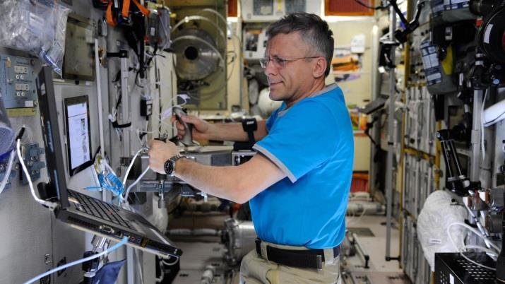
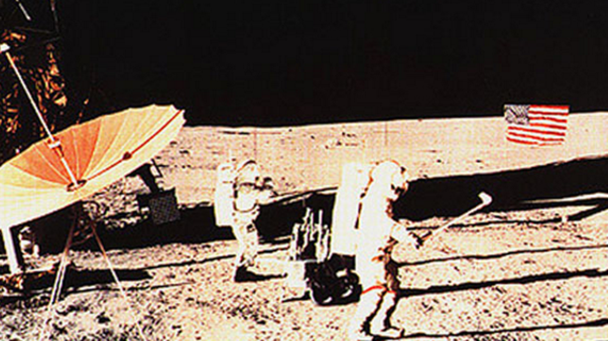

```{r setup, include=FALSE}
knitr::opts_chunk$set(echo = TRUE, rows.print = 20)
```

```{r, echo=FALSE, fig.align='right', out.width="30%"}

```


<br>
<br>
<br>

# When is the prime time to be selected to fly to space?

#### Report of Emanuel Sommer for the Nasa Hackaton of the DSA Munich

\

Hi, my name is Emanuel and I am a 23 year old master student of mathematics. Besides of being into data and R programming I am absolutely inspired and fascinated by space travel. I am not that guy who is into the astrophysics and aliens part but projects like *Artemis* (Moon $\rightarrow$ Mars) are so inspiring for me as they display how humanity can achieve tremendous goals through teamwork, ingenuity and innovation. And for real who hasn't dreamed about a selfie in space :D. So why not try to find out under major simplifications of course at roughly what age I should be drafted into the elite team of astronauts and how much time I have left to become worthy ;).

```{r, echo=FALSE, fig.align='center', out.width="50%"}

# free image
```

First of all the R packages used:

```{r, results = 'hide', message=FALSE, warning=FALSE}
# the general toolbox
library(tidyverse)
# extras for appealing visuals
library(viridis)
library(patchwork)
library(ggtext)
theme_set(
  theme_light() +
    theme(plot.title = ggtext::element_markdown(size = 11),
          plot.subtitle = ggtext::element_markdown(size = 8))
)
```

\newpage

## (1) Get ready for takeoff or data importing & cleaning

Read in the data and get a first glimpse at the variables.

```{r, message=FALSE, warning=FALSE}
astro_data <- read_csv("astronauts.csv")
glimpse(astro_data)
```

The next step is to detect outliers and missing data. Having this done one can decide on a strategy to deal with those.

```{r}
# First the numeric features (get an overview of statistical key numbers here
# just for outlier detection)
astro_data %>%
  select(where(is.numeric)) %>%
  summary()
```

First of all there are no observations with missing values present. Sanity checks for valid values are performed after one has checked the categorical features for missingness. Moreover note that the most recent mission covered here is from 2019.

```{r}
# Check categorical data for NA's at least for the obvious ones 
# (character NAs could be still in there)
astro_data %>%
  select(where(is.character)) %>%
  summarise(across(everything(), ~ sum(is.na(.)))) %>%
  as_vector()
```

So there are definitely some missing values. Let's have a closer look.

```{r}
# display the missing data
astro_data %>%
  filter(if_any(everything(), ~ is.na(.))) %>%
  select(where(~ any(is.na(.))))
```

```{r}
### have a look whether name as the primary key is sufficient
# uniquely identified by name, nationality and year of birth:
astro_data %>%
  group_by(name, nationality, year_of_birth) %>%
  summarise(1, .groups = "drop") %>% nrow() 

# uniquely identified just by name:
length(unique(astro_data$name))

# so one name is double

astro_data %>%
  group_by(name) %>%
  summarise(n_birth_years = length(unique(year_of_birth))) %>%
  filter(n_birth_years > 1)

astro_data %>%
  filter(name == "Aleksandrov, Aleksandr") %>%
  select(id, name, nationality, year_of_birth)

# this is actually once the Bulgarian and once the Russian, as Wikipedia
# writes the Bulgarian one as Alexandar we can change this to have name as
# a unique key
astro_data$name[astro_data$id == 447] <- "Aleksandrov, Alexandar"
```


From this one can conclude that now one can use the `name` variable as the main key for a single astronaut as there are no missing values. As the only missing values occur in the variables `original_name`, once in the `selection`, `mission_title` and in the `ascent_shuttle` and `descent_shuttle` for the same mission in the latter cases one does not have to remove them in this particular case. This is because these variables will not play a crucial role in the further analysis.

As shown below mostly the categorical features have quite many classes and thus are not easily checkable manually, for variables with less then 20 classes this is manageable.

```{r}
# Have a look at how many unique values the variables have
astro_data %>%
  select(where(is.character)) %>%
  mutate(across(everything(), as_factor)) %>%
  summarise(across(everything(), ~ length(unique(.)))) %>%
  as_vector()

# the classes of vars with less than 20 unique classes
astro_data %>%
  select(where(is.character)) %>%
  mutate(across(everything(), as_factor)) %>%
  select(where(~ length(unique(.)) < 20)) %>%
  pivot_longer(everything(), names_to = "variable",
               values_to = "unique_classes") %>%
  group_by(variable, unique_classes) %>%
  summarise(n_obs = n(), .groups = "keep") %>%
  arrange(variable)
```

For the variables `military_civilian` and `sex` the results are not too surprising, but the `occupation` variable shows some data quality issues! For example Flight engineer is covered twice with the only difference being the case of the first letter, same goes for pilot. The occupations PSP and MSP were not clear to me and after a bit of searching I found out that these are the Payload Specialist and the Mission Specialist roles. Regarding all classes that cover somewhat space tourists I will group them all into one category called 'Space tourist'. Funnily enough on Wikipedia (https://en.wikipedia.org/wiki/Astronaut) it says that as of 2020 nobody has even  qualified for the status of space tourist and one could read the full taxonomy in order to correctly assign each of the space travelers the actual correct class but I will omit this here for simplicity reasons.

```{r}
# clean the data according to results
astro_data <- astro_data %>%
  mutate(occupation = case_when(
    occupation == "pilot" ~ "Pilot",
    occupation == "flight engineer" ~ "Flight engineer",
    occupation == "PSP" ~ "Payload Specialist",
    occupation == "MSP" ~ "Mission Specialist",
    occupation == "Other (Journalist)" ~ "Space tourist",
    occupation == "Other (space tourist)" ~ "Space tourist",
    occupation == "Other (Space tourist)" ~ "Space tourist",
    occupation == "spaceflight participant" ~ "Space tourist",
    # for consistent upper case:
    occupation == "commander" ~ "Commander",
    TRUE ~ occupation
  ))

unique(astro_data$occupation)
```


Now one can formulate and perform some basic **sanity checks**:

1. `id` should be unique.
2. `year_of_birth` $\leq$ `year_of_selection`
3. `year_of_selection` $\leq$ `year_of_mission`
4. Check some suspiciously high values from the summary above. (not the ones covered in 5-6.)
5. `hours_mission` $\leq$ `total_hrs_sum` and the sum should be the total + the max is suspiciously high.
6. `eva_hrs_mission` $\leq$ `total_eva_hrs` and the sum should be the total + this is definitely violated as can be seen from the max. So there are definitely data quality issues.
7. All astronauts should have the same number, year of selection and birth in each row.
8. `mission_number` $\leq$ `total_number_of_missions` 
9. Every astronaut has to have a mission number 1.


```{r}
### 1. ----------------
length(unique(astro_data$id)) == nrow(astro_data)

### 2.  ----------------
all(astro_data$year_of_birth <= astro_data$year_of_selection)

### 3.  ----------------
all(astro_data$year_of_selection <= astro_data$year_of_mission)
astro_data %>%
  filter(year_of_selection > year_of_mission) %>%
  select(id, name, year_of_selection, year_of_mission)
# Franco Malerba was actually selected 1977 and not 1998 year of the 
# mission is correct
# Thomas, Andrew S. W. actually had his first spaceflight in 1996 
# (STS-77 as correctly written)

# the rest of Andrew is ok
astro_data %>%
  filter(name == "Thomas, Andrew S. W.") %>%
  select(id, name, year_of_selection, year_of_mission)

# correct the errors
astro_data$year_of_selection[astro_data$id == 648] <- 1977
astro_data$year_of_mission[astro_data$id == 862] <- 1996

### 4. ----------------
# high max nationwide number
astro_data %>%
  arrange(desc(nationwide_number)) %>%
  select(id, name, nationwide_number, number) %>%
  head(3)

astro_data %>%
  filter(name == "Hague, Tyler") %>%
  select(id, name, nationwide_number, number)
# the nationwide number of Hague, Tyler is indeed not correct and thus
# will be adjusted
astro_data$nationwide_number[astro_data$id == 1271] <- 344

# high year of selection
astro_data %>%
  arrange(desc(year_of_selection)) %>%
  select(id, name, year_of_selection, year_of_mission) %>%
  head(3)
# this is correct
```

```{r}
### 5. ----------------
# first a look at the biggest values 
astro_data %>%
  arrange(desc(hours_mission)) %>%
  select(id, name, hours_mission) %>%
  head(5)

astro_data %>%
  arrange(desc(total_hrs_sum)) %>%
  distinct(name, .keep_all = TRUE) %>%
  select(id, name, total_hrs_sum) %>%
  head(3) 
# the max values are correct

# now check the sum over missions (just roughly)
astro_data %>%
  group_by(name) %>%
  summarise(actual_total_hrs = sum(hours_mission),
            total_hrs_sum = total_hrs_sum,
            .groups = "drop") %>%
  # roughly the same +- 2 hour the actual
  mutate(diff_total_hrs = abs(actual_total_hrs - total_hrs_sum)) %>%
  filter(diff_total_hrs > 2) %>%
  arrange(desc(diff_total_hrs)) %>%
  distinct(name, .keep_all = TRUE) %>%
  head(10)
```

Sanity check 5. showed that actually the column `total_hrs_sum` has serious quality issues! I checked for the first 4 largest differences between calculated total time spend in space and the given variable `total_hrs_sum` and every time the `total_hrs_sum` variable was wrong and the newly calculated column was spot on right. Thus as there at least ~80 rows with at least some issue I will proceed by removing `total_hrs_sum` from the data set and add the calculated `calc_total_hrs` column instead, which corresponds to the `actual_total_hrs` above.

```{r}
astro_data <- astro_data %>%
  select(-total_hrs_sum) %>%
  group_by(name) %>%
  mutate(calc_total_hrs = sum(hours_mission)) %>%
  ungroup()
```


```{r}
### 6. ----------------
# the highest eva_hrs_mission is for sure wrong so have a look
astro_data %>%
  arrange(desc(eva_hrs_mission)) %>%
  select(id, name, eva_hrs_mission, total_eva_hrs) %>%
  head(5)

# Solovyev, Anatoly indeed has the biggest total eva time of correctly 78 hours
# but thus the 89.13 is not one of his 16 spacewalks but instead ...
solovey_446_spacewalk <- astro_data %>%
  filter(name == "Solovyev, Anatoly") %>%
  filter(eva_hrs_mission < 80) %>%
  summarise(total_eva_hrs - sum(eva_hrs_mission)) %>%
  distinct() %>% 
  as.numeric()
solovey_446_spacewalk
# correct it
astro_data$eva_hrs_mission[astro_data$id == 446] <- solovey_446_spacewalk

# now again check the sum over missions (just roughly)
astro_data %>%
  group_by(name) %>%
  summarise(actual_total_eva = sum(eva_hrs_mission),
            total_eva_hrs = total_eva_hrs,
            .groups = "drop") %>%
  # roughly the same +- 2 hour the actual
  mutate(diff_total_eva = abs(actual_total_eva - total_eva_hrs)) %>%
  filter(diff_total_eva > 2) %>%
  arrange(desc(diff_total_eva)) %>%
  distinct(.keep_all = TRUE)

astro_data %>%
  filter(name == "Hague, Tyler") %>%
  select(id, name, eva_hrs_mission, total_eva_hrs, in_orbit)
# so wrongly Hague, Tyler got his eva hours also for the aborted flight
# this is of course wrong and should be corrected

astro_data$eva_hrs_mission[astro_data$id == 1270] <- 0


astro_data %>%
  filter(name == "Leestma, David C.") %>%
  select(id, name, eva_hrs_mission, total_eva_hrs, in_orbit)
# here the eva_hrs_mission of the sts-41-G is wrongly set to 1 but it were
# 3.5 hours as correctly stated in the total_eva_hrs column
astro_data$eva_hrs_mission[astro_data$id == 316] <- 3.5

```

```{r}
### 7. ----------------
astro_data %>%
  group_by(name) %>%
  summarise(n_number = length(unique(number)),
            n_nat_number = length(unique(nationwide_number)),
            n_selection = length(unique(year_of_selection)),
            n_birth = length(unique(year_of_birth))) %>%
  filter(n_number > 1 | n_nat_number > 1 |
           n_selection > 1 | n_birth > 1) %>%
  nrow() == 0

### 8. ----------------
all(astro_data$mission_number <= astro_data$total_number_of_missions)

### 9. ----------------
astro_data %>%
  group_by(name) %>%
  summarise(valid_mission_number = all(sort(mission_number) == seq(n()))) %>%
  filter(!valid_mission_number)

astro_data %>%
  filter(str_detect(name, "Shepard")) %>%
  select(id, name, mission_number, total_number_of_missions, mission_title, year_of_mission)
# So actually the first mission of Alan Shepard with the Mercury-Redstone 3 
# is not in the data set maybe as it was only a suborbital flight but then 
# the mission number should be 1. From the two ways of proceeding i.e. 
# setting the mission number to 1 or adding an additional row for the MR-3
# launch I will pick the first option. Either way this decision won't impact the 
# further analysis a lot
astro_data$mission_number[astro_data$id == 117] <- 1
astro_data$total_number_of_missions[astro_data$id == 117] <- 1

```


Now as the data set can pass the specified sanity checks it is time for some feature engineering i.e. add interesting additional variables for further analysis to the data set.

1. The age of the astronaut when selected: `age_selected`
2. The duration from selection to the first mission: `train_time`
3. The decade an astronaut was selected: `decade_sel`
4. As can be seen in the below visualization Russia and the US have by far the most space-travelers and thus the new column `nationality_red` covers just the three levels 'U.S.', 'U.S.S.R./Russia' and 'Rest of the world'.

```{r}
astro_data %>%
  filter(mission_number == 1) %>%
  group_by(nationality) %>%
  summarise(n = n()) %>%
  ungroup() %>%
  mutate(nationality = as_factor(nationality),
         nationality = fct_reorder(nationality, n)) %>%
  ggplot(aes(x = nationality, y = n)) +
  geom_col(fill = plasma(1)) +
  coord_flip() +
  labs(y = "Number of astronauts", x = "Nationality") +
  scale_y_log10()

astro_data <- astro_data %>%
  mutate(age_selected = year_of_selection - year_of_birth) %>%
  group_by(name) %>%
  mutate(train_time = min(year_of_mission) - year_of_selection) %>%
  ungroup() %>%
  mutate(decade_sel = 10 * (year_of_selection %/% 10),
         nationality_red = case_when(
           nationality %in% c("U.S.", "U.S.S.R/Russia") ~ nationality,
           TRUE ~ "Rest of the world"
         ))
```

As the current data set has possibly multiple rows corresponding to the missions of an astronaut I create also a data set with just one row per astronaut that contains the most important facts around the individual. That means of course that no mission specific data is contained in the new `astro_data_ind` data set. As the further analysis will focus on the individual level and not the mission level one saves a lot of `group_by()` calls.

```{r}
astro_data_ind <- astro_data %>%
  filter(mission_number == 1) %>%
  select(-mission_number, -year_of_mission, -mission_title,
         -ascend_shuttle, -in_orbit, -descend_shuttle,
         -hours_mission, -field21, -eva_hrs_mission) 
```

\newpage

## (2) Takeoff or statistical key numbers

So in order to take my selfie in space I have to be selected and to be selected I have to put in some work to become worthy. So the question is how much in a hurry should I be? Thus the new variable `age_selected` will be at the core of the further analysis in order to find out a reasonable or even a perfect(?) selection age for me. On the way I might also stumble upon a nice more general hypothesis to check:). To accomplish this a close look at the univariate distribution and key statistical features is a good first step.

```{r}
summary(astro_data_ind$age_selected)
```
One can see that overall the IQR of 6 is quite small. So most of the astronauts are selected in their early to mid thirties. The fact that the mean and median are quite close to each other indicates that the empirical distribution could be symmetric.
The youngest astronaut to be selected was 23 years and the oldest 60 years old. Let's get to know the youngest and oldest to be selected:

```{r}
# the youngest
astro_data_ind %>%
  arrange(age_selected) %>%
  select(name, age_selected, occupation, year_of_selection, nationality) %>%
  head(4)
```

Clearly the youngest selected astronauts were all selected in the midst of the space race in the former U.S.S.R. 

```{r}
# the oldest
astro_data_ind %>%
  arrange(age_selected) %>%
  select(name, age_selected, occupation, year_of_selection, nationality) %>%
  tail(4)
```

The oldest selected astronauts are all space tourist but actually followed quite closely by a professional astronaut. The fact that space tourists are generally quite old when selected comes probably from the hefty price tag a trip to space as a tourist still has. Basically right now it is billionaires only. If Virgin Galactic and Blue Origin can keep their promises to make space travel more affordable in the upcoming years the average age of at least the commercial astronauts could decrease. 

In order to get a really good sense of an univariate distribution I like to combine some different visualization techniques that let me grab not only the overall silhouette of the distribution (e.g. with KDE), but also statistical key numbers (e.g. through a boxplot) and most importantly also subtle details like discrete clusters of data points (e.g. suitable histogram). Moreover a jittered pointcloud can mitigate the general problem of boxplots that they could be shaped strongly by small point clusters especially in low sample size scenarios. Note that for most of the upcoming scatterplots will use jittering so please be aware of that w.r.t. interpretation.


```{r}
age_selected_box <- ggplot(astro_data_ind, aes(x = 1, y = age_selected)) +
  geom_jitter(alpha = 0.5, col = plasma(1), shape = 4) +
  geom_boxplot(col = "black", size = .8, fill = NA) +
  labs(x = "", y = "Selection age") +
  coord_flip() +
  theme(axis.ticks.y = element_blank(),
        axis.text.y = element_blank())

age_selected_hist <- ggplot(astro_data_ind, aes(x = age_selected)) +
  geom_histogram(aes(y = ..density..),
                 fill = plasma(1), binwidth = 1.1,
                 alpha = 0.5) +
  geom_density(aes(y = ..density..),
                 col = "black", size = 0.8) +
  labs(x = "", y = "", subtitle = "Histogram binwidth = 1.1",
       title = "Univariate view:  **Selection age**") +
  theme(axis.ticks.y = element_blank(),
        axis.text.y = element_blank())
age_selected_hist / age_selected_box
```

Except for the outliers that produce an overall just slightly right skewed empirical distribution the empirical distribution is actually quite symmetric and bell shaped. As mentioned above most of the astronauts were selected in their early to mid thirties. A transformation of the data is not reasonable at this point.

> **Hypothesis:** The selection age has changed over time and there are certain subgroups of astrounauts e.g. w.r.t. sex or occupation that show different patterns regarding the selection age. Were the selection ages of the astronauts of the space race lower and then grew over time. What were the selection ages of very successfull astronauts?

In order to find indications for or against this hypothesis the multivariate dependencies with other variables have to be examined in the next part.

<!--
### Training time

```{r}
summary(astro_data_ind$train_time)
```

One can see that overall the IQR of 5 is again quite small. So most of the astronauts are 3 to 8 years until their first mission. The fact that the mean and median are quite close to each other indicates again that the empirical distribution could be symmetric.
The maximum training time of 21 years is really far from the 3rd quantile, and of course the training time is bounded from below by 0. So it is interesting to have a look at the corner cases i.e. how many astronauts had their first mission in the same year they were selected and what about those who had a really long training time.

```{r}
astro_data_ind %>%
  arrange(train_time) %>%
  select(name, train_time, occupation, year_of_selection, nationality) %>%
  filter(train_time == 0) %>%
  group_by(nationality) %>%
  summarise(n = n())
```


```{r}
astro_data_ind %>%
  arrange(train_time) %>%
  select(name, train_time, occupation, year_of_selection, nationality) %>%
  tail(4)
```


```{r}
train_time_box <- ggplot(astro_data_ind, aes(x = 1, y = train_time)) +
  geom_jitter(alpha = 0.5, col = plasma(1), shape = 4) +
  geom_boxplot(col = "black", size = .8, fill = NA) +
  labs(x = "", y = "Training time in years") +
  scale_y_continuous(breaks = seq(0, 20, 2)) +
  coord_flip() +
  theme(axis.ticks.y = element_blank(),
        axis.text.y = element_blank())

train_time_hist <- ggplot(astro_data_ind, aes(x = train_time)) +
  geom_histogram(aes(y = ..density..),
                 fill = plasma(1), binwidth = 1,
                 alpha = 0.5) +
  geom_density(aes(y = ..density..),
                 col = "black", size = .8) +
  labs(x = "", y = "", subtitle = "Histogram binwidth = 1",
       title = "Univariate view:  **Training time**") +
  scale_x_continuous(breaks = seq(0, 20, 2)) +
  theme(axis.ticks.y = element_blank(),
        axis.text.y = element_blank(),)
train_time_hist / train_time_box
```

-->

\newpage

## (3) Apogee & splashdown or visualization & conclusion

### Selection age over time

```{r}
# jittered scatterplot of selection age vs time
ggplot(astro_data_ind, aes(x = year_of_selection, y = age_selected)) +
  geom_jitter(alpha = 0.2, col = plasma(1), height = 0) +
  labs(x = "Selection year", y = "Selection age",
       title = "**Evolution of the selection age**") +
  geom_smooth(method = "loess", se = F, formula = 'y ~ x', size = 0.8,
              col = "black") +
  scale_x_continuous(breaks = seq(1960, 2010, 10)) +
  theme(panel.grid.minor.x = element_blank()) +
# grouped boxplots by decade
ggplot(astro_data_ind, aes(x = factor(decade_sel), y = age_selected)) +
  geom_jitter(col = plasma(1), alpha = 0.1) +
  geom_boxplot(col = "black", size = .8, fill = NA) +
  labs(x = "Decade", y = "") +
# get the desired layout
plot_layout(widths = c(6, 5))
```

So indeed the data shows an overall positive trend that indicates an average selection age of roughly in the early thirties during the space race in the 1960ies that rises steadily until reaching a level of roughly 37 years in the 2010s. In the right plot that shows grouped boxplots w.r.t. the decade interesting enough the first an last boxplot contradict the overall trend somehow, in the first case this is probably due to the really small sample and in the latter case this could be due to the fact that the U.S. has lost it's capability to launch people into space due to the last space shuttle mission being in 2011. Only in the last years the U.S. regained the ability to put people into space with the Crew Dragon spacecraft. This could explain the reduced number of astronauts selected in this decade and gives rise to the question whether different nations select astronauts at differing ages. Does the U.S. select older astronauts? The rate of growth of the selection age overall also seems to dampen. So the average selection age will probably reach a stationary point somewhere a little below the average age of a working person for example 40. But before making such forecasts one should have a look at the other variables w.r.t. selection age.

### Selection age w.r.t. categories

Now one can look at the categorical variables and their relationship with the evolution of the selection age.

- `sex`
- `nationality_red` just compare the two biggest space nations so far and the rest of the world.
- `military_civilian`
- `occupation`

```{r}
# conditional scatterplot -wrt sex- of the selection age over time
ggplot(astro_data_ind, aes(x = year_of_selection, y = age_selected,
                           col = factor(sex))) +
  geom_jitter(aes(shape = factor(sex)), alpha = 0.2, height = 0) +
  labs(x = "Selection year", y = "Selection age",
       title = "**Evolution & distribution of the selection age**",
       subtitle = paste("by",
                        "<span style='color:",
                        plasma(3)[1],
                        "'>**female**</span>",
                        " and ",
                        "<span style='color:",
                        plasma(3)[2],
                        "'>**male**</span>",
                        " astronauts")) +
  geom_smooth(method = "loess", se = F, formula = 'y ~ x', size = 0.8) +
  scale_color_manual(values = plasma(3)[1:2]) +
  scale_x_continuous(breaks = seq(1960, 2010, 10)) +
  guides(col = "none", shape = "none") +
  theme(panel.grid.minor.x = element_blank()) +
# compare the conditional distributions with side to side boxplots
ggplot(astro_data_ind, aes(x = factor(sex), y = age_selected,
                           col = factor(sex))) +
  geom_boxplot(size = .8, fill = NA) +
  scale_color_manual(values = plasma(3)[1:2]) +
  guides(col = "none") +
  labs(x = "Sex", y = "") +
# get the desired layout
plot_layout(widths = c(2, 1))
```

First and foremost it has to be mentioned that with only a fraction of `r round(mean(astro_data_ind$sex == "female"),3)` a lot less women than men have gone to space yet. But when looking at the Artemis team one can detect a 50:50 ratio of women and men. So this seems to go into the right direction at least concerning NASA. But besides that when looking at the above plot it seems evident that both the selection age of female and male astronauts follows a similar rising trend but with the distinct difference that female astronauts are selected roughly 3-5 years early than their male colleagues. Moreover no female older than 50 was selected to become an astronaut. Yes I know Jeff launched a really old woman and really young man into space recently (suborbital) but they are just commercial astronauts and I have not forgotten the Inspiration 4 crew but now focus on the professional ones. Overall I am not quite sure why female astronauts are selected earlier and maybe a smart guy from NASA would have a reasonable explanation for me as the difference is notable.


```{r}
# conditional scatterplot -wrt military status- of the selection age over time
ggplot(astro_data_ind, aes(x = year_of_selection, y = age_selected,
                           col = factor(nationality_red))) +
  geom_jitter(aes(shape = factor(nationality_red)),
              alpha = 0.1, height = 0) +
  labs(x = "Selection year", y = "Selection age",
       title = "**Evolution & distribution of the selection age**",
       subtitle = paste("by",
                        "<span style='color:",
                        plasma(4)[2],
                        "'>**U.S.**</span>",
                        ", ",
                        "<span style='color:",
                        plasma(4)[3],
                        "'>**U.S.S.R/Russia**</span>",
                        " and ",
                        "<span style='color:",
                        plasma(4)[1],
                        "'>**rest of the world**</span>",
                        " astronauts")) +
  geom_smooth(method = "loess", se = F, formula = 'y ~ x', size = 0.8) +
  scale_color_manual(values = plasma(4)[1:3]) +
  scale_x_continuous(breaks = seq(1960, 2010, 10)) +
  guides(col = "none", shape = "none") +
  theme(panel.grid.minor.x = element_blank()) +
# compare the conditional distributions with side to side boxplots
ggplot(astro_data_ind, aes(x = factor(nationality_red), y = age_selected,
                           col = factor(nationality_red))) +
  geom_boxplot(size = .8, fill = NA) +
  scale_color_manual(values = plasma(4)[1:3]) +
  guides(col = "none") +
  labs(x = "Nation(s)", y = "") +
# get the desired layout
plot_layout(widths = c(3, 2))
```

Visible in this plot is not only that until the late 1970s the space was the playground for only two big nations but that between these two nations and the rest of the world is a difference in the selection ages of their astronauts. The overall rising trend of the selection age is true for all three classes. Right from the beginning of the space exploration U.S. astronauts are selected at on average at least 2 years later than U.S.S.R/Russian astronauts. This gap seemed to widen after the mid 1990s as the U.S. has selected more and more older astronauts while Russia has been quite constant at an age roughly in the early 30s. The same rise in average selection age in the mid 1990s seemed to happen for the class rest of the world. This could be a change in dogma of the NASA which could have been adapted by the ESA and JAXA which work quite closely with NASA and until now ESA/ JAXA astronauts did make up a considerable portion of rest of the world astronauts.


```{r}
# conditional scatterplot -wrt military status- of the selection age over time
ggplot(astro_data_ind, aes(x = year_of_selection, y = age_selected,
                           col = factor(military_civilian))) +
  geom_jitter(aes(shape = factor(military_civilian)),
              alpha = 0.2, height = 0) +
  labs(x = "Selection year", y = "Selection age",
       title = "**Evolution & distribution of the selection age**",
       subtitle = paste("by",
                        "<span style='color:",
                        plasma(3)[2],
                        "'>**military**</span>",
                        " and ",
                        "<span style='color:",
                        plasma(3)[1],
                        "'>**civilian**</span>",
                        " status astronauts")) +
  geom_smooth(method = "loess", se = F, formula = 'y ~ x', size = 0.8) +
  scale_color_manual(values = plasma(3)[1:2]) +
  scale_x_continuous(breaks = seq(1960, 2010, 10)) +
  guides(col = "none", shape = "none") +
  theme(panel.grid.minor.x = element_blank()) +
# compare the conditional distributions with side to side boxplots
ggplot(astro_data_ind, aes(x = factor(military_civilian), y = age_selected,
                           col = factor(military_civilian))) +
  geom_boxplot(size = .8, fill = NA) +
  scale_color_manual(values = plasma(3)[1:2]) +
  guides(col = "none") +
  labs(x = "Military status", y = "") +
# get the desired layout
plot_layout(widths = c(2, 1))
```

Surprisingly enough it does not seem to be a considerable interdependence of the military status and the selection age over time.


```{r}
# conditional scatterplot -wrt occupation- of the selection age over time
ggplot(astro_data_ind, aes(x = year_of_selection, y = age_selected,
                           col = factor(occupation))) +
  geom_jitter(alpha = 0.1, height = 0) +
  labs(x = "Selection year", y = "Selection age",
       title = "**Evolution of the selection age**",
       subtitle = "by occupation") +
  geom_smooth(method = "loess", se = F, formula = 'y ~ x', size = 0.8) +
  scale_color_manual(values = plasma(7)[1:6], name = "Occupation") +
  scale_x_continuous(breaks = seq(1960, 2010, 10)) +
  # guides(col = "none", shape = "none") +
  theme(panel.grid.minor.x = element_blank()) 
# compare the conditional distributions with side to side boxplots
ggplot(astro_data_ind, aes(x = factor(occupation), y = age_selected,
                           col = factor(occupation))) +
  geom_boxplot(size = .8, fill = NA) +
  scale_color_manual(values = plasma(7)[1:6]) +
  guides(col = "none") +
  coord_flip() +
  labs(x = "", y = "Selection age",
       title = "**Distribution of the selection age**",
       subtitle = "by occupation") 
```


The condensed take away information of these two plots is that other than for professional astronauts that are selected mainly during their 30s the space tourists selection age can spread over a much higher range as not qualification and prime cognitive and physical abilities are needed but mostly a big wallet. This is I guess common sense. Otherwise no occupation class stood really out besides maybe the Payload Specialist being a little older and the lower blue line corresponding to the occupation commander is most likely lower due to the class being used mainly from the U.S.S.R/Russia and as seen above they selected at a younger age on average over time.


### You got selected but how long are you gonna be trained?

Is there a relationship like the older you get selected the shorter or longer the training time? Let's find out.

```{r}
astro_data_ind %>%
  mutate(professional = occupation != "Space tourist") %>%
  ggplot(aes(x = train_time, y = age_selected, col = factor(professional))) +
    geom_jitter(alpha = 0.3, width = 0) +
    labs(x = "Training time", y = "Selection age",
         title = "**Selection age w.r.t. training time**",
         subtitle = paste0("by ",
                        "<span style='color:",
                        plasma(3)[2],
                        "'>**professional astronaut**</span>",
                        " and ",
                        "<span style='color:",
                        plasma(3)[1],
                        "'>**space tourist**</span>",
                        ".")) +
    geom_smooth(method = "loess", se = F, formula = 'y ~ x', size = 0.8,
                col = "black") +
    guides(col = "none") +
    scale_color_manual(values = plasma(3)[1:2])
```

Clearly space tourists have quite short training times of at most 2 years and thus contribute to the slight trend that the older you get the shorter the training time until the first flight. But this effect seems to be quite weak. So overall when thinking of my selfie in space I would probably have to go through a median training time of `r round(median(astro_data_ind$train_time))` years quite independent of the age selected and neglecting other effects on training time like nationality.


### Selection age w.r.t. greatest achievements

Let's assume one gets selected. To have a higher likelihood of making great space selfies high values of the following variables are good to have:

- `calc_total_hrs` the total amount of time spend in space.
- `total_eva_hrs` the total amount of time on EVA.
- `total_number_of_missions`.

Is there a relationship of these key astronaut CV numbers with the age they were selected? It would make kind of sense if earlier selected astronauts would be able to accumulate more EVA and overall space time, right?

In order to address these questions again some visualizations with the (not always unique) record holders w.r.t. one of the above mentioned variables by the decade.


```{r}
# extract the astronauts with the most time spend in space per decade selected
max_time_spend_per_decade <- astro_data_ind %>%
  mutate(calc_total_days = calc_total_hrs / 24) %>%
  group_by(decade_sel) %>%
  slice_max(order_by = calc_total_hrs, n = 1) %>%
  ungroup()
max_time_spend_per_decade %>%
  select(name, age_selected, year_of_selection, nationality, calc_total_days)


astro_data_ind %>%
  filter(!(name %in% max_time_spend_per_decade$name)) %>%
  mutate(calc_total_days = calc_total_hrs / 24) %>%
  ggplot(aes(x = year_of_selection, y = age_selected,
             size = calc_total_days, label = name)) +
    geom_jitter(alpha = 0.2, col = plasma(3)[1]) +
    geom_point(data = max_time_spend_per_decade,
      col = plasma(3)[2]) +
    labs(x = "Selection year", y = "Selection age",
         size = "Days in space",
         title = "**Evolution of the selection age**",
         subtitle = paste0(
           "Highlighting the total days spend in space and the",
           "<span style='color:",
           plasma(3)[2],
           "'> astronauts with the most days in space by decade</span>",
           ".")) +
    ggrepel::geom_text_repel(
      data = max_time_spend_per_decade,
      max.overlaps = Inf, box.padding = 2.2,
      size = 3.5, segment.color = plasma(3)[2],
      segment.size = .8,
      col = "black",
      fontface = "bold") +
    scale_x_continuous(breaks = seq(1960, 2010, 10)) +
    theme(panel.grid.minor.x = element_blank())
   

```


So there are some interesting takeaways here:
- The astronauts selected in the 1960s had quite short total in space time. As the first space stations evolved starting in the early 1970s this could be a reason for the shorter career stats.
- One can see that overall U.S.S.R/Russia has provided the most decade record holders here.
- The overall trend is that the older one gets the less likely is it to have an extremely long space journey. But for example Andrei Borisenko was selected at an age of 39 years and spend a looot of time in space! So in general here not really the earlier the better but a selection age of below 40 seems to be a good spot with the goal of many space hours in mind.

```{r, echo=FALSE, fig.align='center', out.width="50%", fig.cap='Andrei Borisenko on the ISS'}

# https://www.google.com/url?sa=i&url=https%3A%2F%2Fwww.researchgate.net%2Ffigure%2FCosmonaut-Andrei-Borisenko-at-the-experimental-workstation-on-board-the-ISS_fig2_334230798&psig=AOvVaw1TMYwP1On1hnVWZnzKDu5K&ust=1633779849100000&source=images&cd=vfe&ved=0CAsQjRxqFwoTCODb0bfeuvMCFQAAAAAdAAAAABAD
```


```{r}
# extract the astronauts with the most time spend during eva per decade selected
max_eva_spend_per_decade <- astro_data_ind %>%
  group_by(decade_sel) %>%
  slice_max(order_by = total_eva_hrs, n = 1) %>%
  ungroup()
max_eva_spend_per_decade %>%
  select(name, age_selected, year_of_selection, nationality, total_eva_hrs)

astro_data_ind %>%
  filter(!(name %in% max_eva_spend_per_decade$name)) %>%
  ggplot(aes(x = year_of_selection, y = age_selected,
             size = total_eva_hrs, label = name)) +
    geom_jitter(alpha = 0.2, col = plasma(3)[1]) +
    geom_point(data = max_eva_spend_per_decade,
      col = plasma(3)[2]) +
    labs(x = "Selection year", y = "Selection age",
         size = "Total EVA hours",
         title = "**Evolution of the selection age**",
         subtitle = paste0(
           "Highlighting the total EVA hours and the",
           "<span style='color:",
           plasma(3)[2],
           "'> astronauts with the most EVA hours by decade</span>",
           ".")) +
    ggrepel::geom_text_repel(
      data = max_eva_spend_per_decade,
      max.overlaps = Inf, box.padding = 2.2,
      size = 3.5, segment.color = plasma(3)[2],
      segment.size = .8,
      col = "black",
      fontface = "bold") +
    scale_x_continuous(breaks = seq(1960, 2010, 10)) +
    theme(panel.grid.minor.x = element_blank())
```

Again a similar picture as before emerges. I found it really interesting that Alan Shepard who is undoubtedly a superstar of space travel holds the record for the longest EVA time for astronauts selected in the 1950s. He is definitely known to be the first American astronaut but at least I did not now that he was the 5th man on the moon and was even golfing on the moon :). I mean how cool is that, he took a golf racket and two balls to the moon. If you wonder the ball went 37 meters. 

```{r, echo=FALSE, fig.align='center', out.width="50%", fig.cap='Alan Shepard playing golf on the moon'}

# https://www.google.com/url?sa=i&url=https%3A%2F%2Fwww.watson.ch%2Funvergessen%2Fraumfahrt%2F697017243-06-02-1971-alan-shepard-schmuggelt-einen-schlaeger-auf-den-mond-um-golf-zu-spielen&psig=AOvVaw0wX7zKJkiG4Qd33H1Lbh0Y&ust=1633779671071000&source=images&cd=vfe&ved=0CAsQjRxqFwoTCMj41eDduvMCFQAAAAAdAAAAABAD
```

Besides these fun facts again the selection age does not really seem to influence the possibility to have many EVA hours that much, so again a selection age of below 40 should be a good starting point. Moreover except for Alan Shepard the record holders seem to follow a positive trend but I will not try to further forecast based on these 6 extraordinary people as this is more of fun fact material and not rigorous evidence.


```{r}
# extract the astronauts with the most missions per decade selected
# importantly without ties
max_missions_per_decade <- astro_data_ind %>%
  group_by(decade_sel) %>%
  slice_max(order_by = total_number_of_missions, n = 1,
            with_ties = FALSE) %>%
  ungroup()
max_missions_per_decade %>%
  select(name, age_selected, year_of_selection, nationality,
         total_number_of_missions)

astro_data_ind %>%
  filter(!(name %in% max_missions_per_decade$name)) %>%
  ggplot(aes(x = year_of_selection, y = age_selected,
             size = total_number_of_missions, label = name)) +
    geom_jitter(alpha = 0.2, col = plasma(3)[1]) +
    geom_point(data = max_missions_per_decade,
      col = plasma(3)[2]) +
    labs(x = "Selection year", y = "Selection age",
         size = "#missions",
         title = "**Evolution of the selection age**",
         subtitle = paste0(
           "Highlighting the #missions and the",
           "<span style='color:",
           plasma(3)[2],
           "'> astronauts with the most missions by decade</span>",
           ". (here: not unique)")) +
    ggrepel::geom_text_repel(
      data = max_missions_per_decade,
      max.overlaps = Inf, box.padding = 2.2,
      size = 3.5, segment.color = plasma(3)[2],
      segment.size = .8,
      col = "black",
      fontface = "bold") +
    scale_x_continuous(breaks = seq(1960, 2010, 10)) +
    theme(panel.grid.minor.x = element_blank())
```

First of all who is Jerry Ross? He appears already the second time and I have never heard of him. Turns out he is a real astronaut hall-of-famer! He is the first human to complete 7 space missions, spend 58 days in space and 58 hours outside the vehicle, aren't these stats great?

```{r, echo=FALSE, fig.align='center', out.width="30%", fig.cap='Jerry Ross with his 7 mission badges'}

# https://www.google.com/url?sa=i&url=https%3A%2F%2Fde.wikipedia.org%2Fwiki%2FJerry_Ross&psig=AOvVaw0x2VZmr3tol_qWg091lve2&ust=1633779482010000&source=images&cd=vfe&ved=0CAsQjRxqFwoTCMDhuoPeuvMCFQAAAAAdAAAAABAD
```

And once again a similar picture as for the last two plots is visible. Although her quite a considerable mass of people with a lot of missions was selected before their 35th birthday, so again a slight tendency towards an early selection.


### So when can I expect to make that space selfie?

To conclude there is not **the** age you should be selected to become an astronaut with a lot of EVA hours or other high career stats. Overall a trend over time towards the selection of astronauts at a higher age (early $\rightarrow$ late thirties) was detected and it turned out that the sex and nationality of the to be astronaut were the most influential features w.r.t. the selection age. I actually expected the military status to have an effect but at least at the bivariate level this was not the case. One could of course get an even better sense for higher order and joint dependencies and influence by modeling the data with vine-copulas, various regression or other models but this is a task for another time. Besides if you are a space tourist selection age is not even a thing, just be moderately healthy and filthy rich. As I am a 23 year old male, not filthy rich and from Germany I will probably have roughly 15 years (then my late 30s) in order to get worthy of becoming an astronaut and then making that gorgeous space selfie. Additionally I do not have to stress myself as it was visible that unless you are selected way beyond the 40s there is still the chance to accumulate a quite impressive space portfolio even with a high selection age. So who knows, with a the median training time of 6 years I might gaze down on earth in 20 years while a space drone takes an amazing 'selfie' of me ;D.

**Thanks for sticking with it!**


